<div align="center">
  <h1>Order Management</h1>
  <p>Sistema de gerenciamento de pedidos para autoatendimento de fast food</p>

[](https://kotlinlang.org/)
[](http://www.gnu.org/licenses/agpl-3.0)
[](https://opensource.org/licenses/)
[](http://www.gnu.org/licenses/agpl-3.0)
[](http://www.gnu.org/licenses/agpl-3.0)
[](http://www.gnu.org/licenses/agpl-3.0)
</div>

## Visão Geral

Projeto desenvolvido para gerenciamento de autoatendimento de restaurantes, tendo como funcionalidades:

- Gerenciamento de pedidos
- Gerenciamento de clientes
- Gerenciamento de produtos
- Gerenciamento de pagamento

## Índice

- [Visão Geral](#visão-geral)
- [Requisitos de Negócio](#requisitos-de-negócio)
- [Arquitetura de Infraestrutura](#arquitetura-de-infraestrutura)
- [Documentação da API](#documentação-da-api)
- [Configuração do Ambiente](#configuração-do-ambiente)
- [Desenvolvimento](#desenvolvimento)
- [Equipe](#desenvolvedores)

## Requisitos de Negócio

### Gerenciamento de Produtos
<details>
<summary>Clique para expandir</summary>

#### Cadastro de Produtos
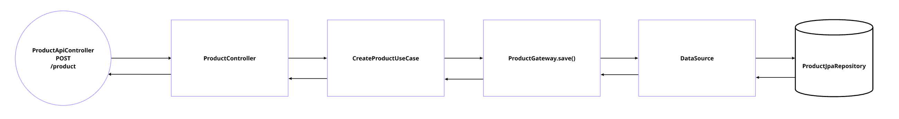

#### Atualização de Produtos
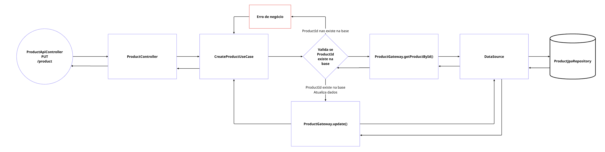

#### Consulta de Produtos
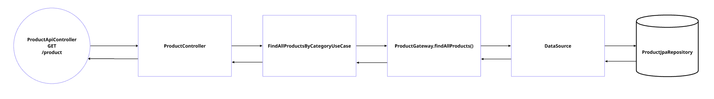

#### Produtos por Categoria
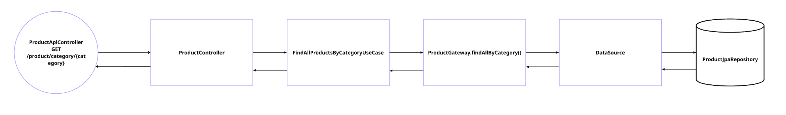

#### Consulta por ID
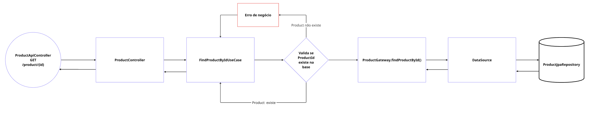

#### Remoção de Produtos
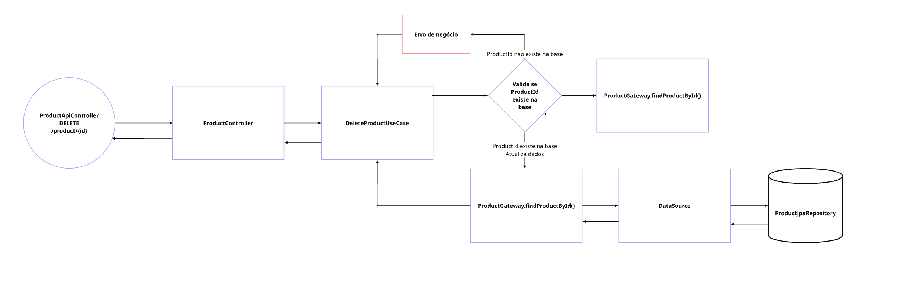
</details>

### Gerenciamento de Clientes
<details>
<summary>Clique para expandir</summary>

#### Cadastro de Cliente
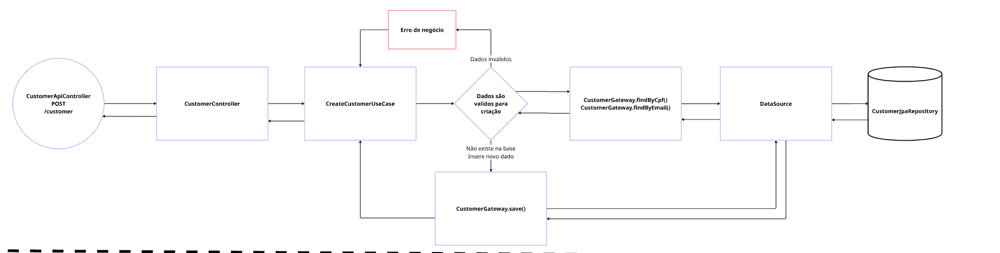

#### Consulta Clientes
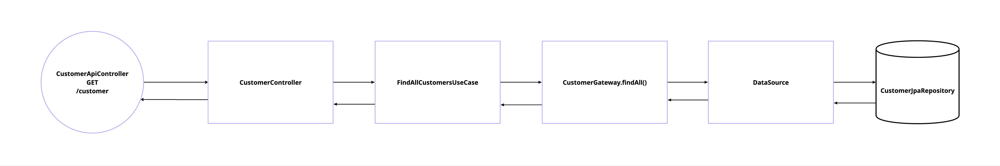

#### Consulta cliente por identificador
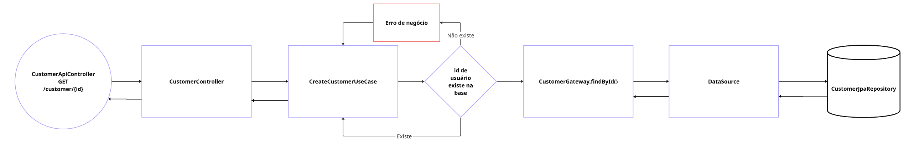

#### Consulta cliente por cpf
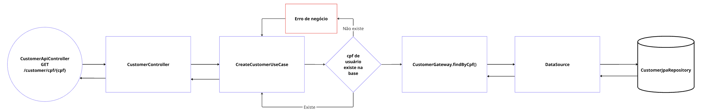

#### Consulta cliente por email
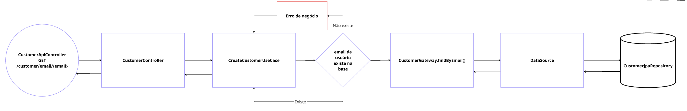

#### Atualização de dados de Clientes
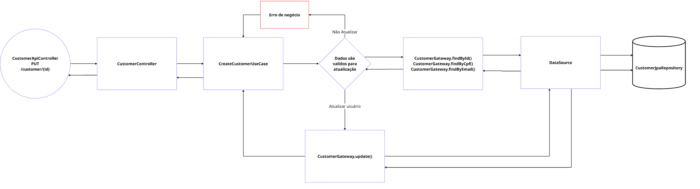

#### Deleta Clientes
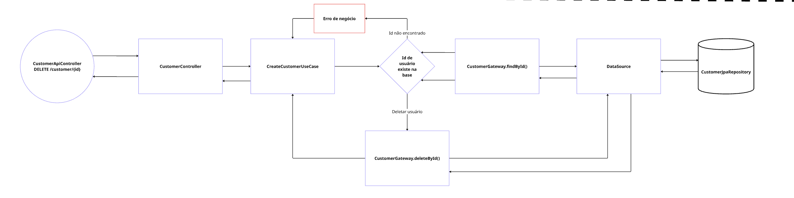
</details>

### Gerenciamento de Pedidos
<details>
<summary>Clique para expandir</summary>

#### Cadastro de pedido
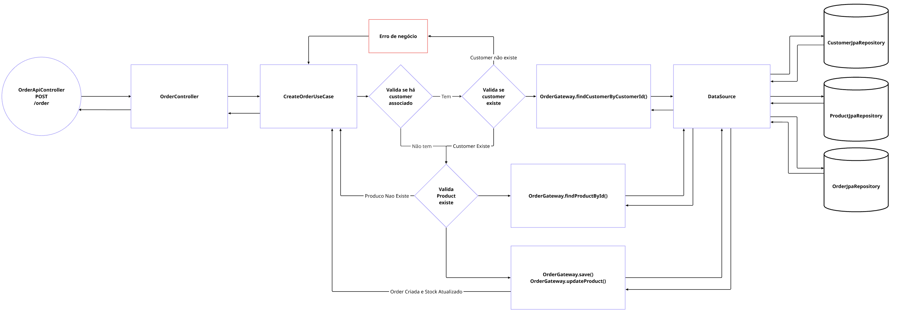

#### Atualização de pedido
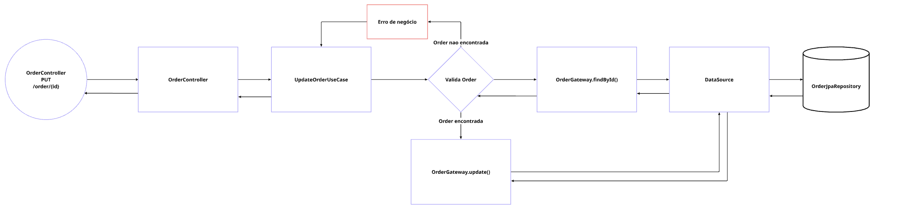

#### Consulta de pedidos
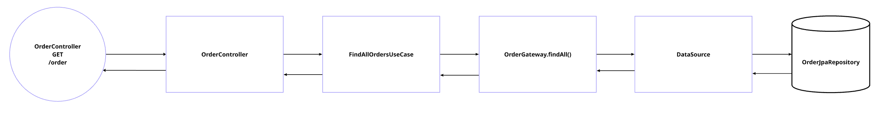

#### Consulta pedidos por Status
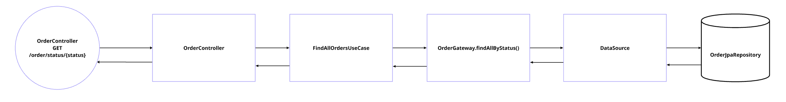

#### Consulta por ID
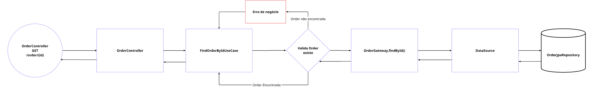

#### Cancelamento de pedido
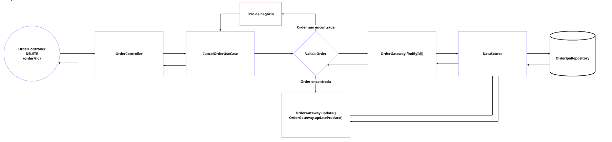
</details>

### Gerenciamento de Pagamentos
<details>
<summary>Clique para expandir</summary>

#### Consulta de pagamento por identificador
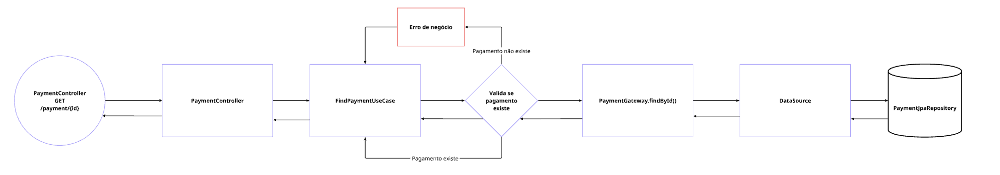

#### Criação de pagamento para histórico e geração de QRCode no provedor
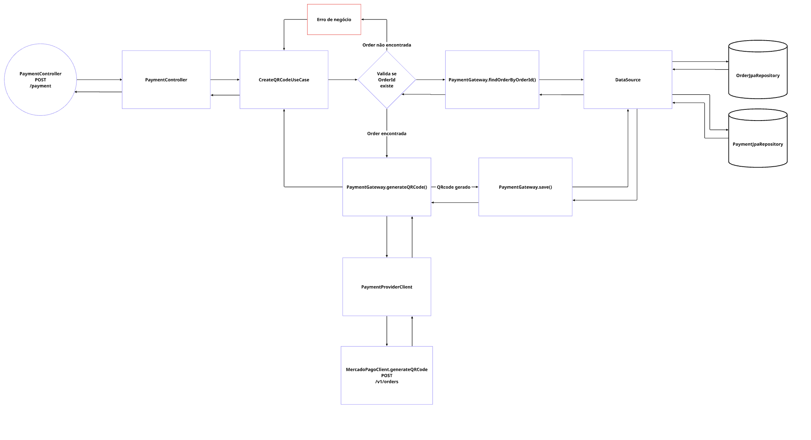

#### Processamento de webhook do provedor
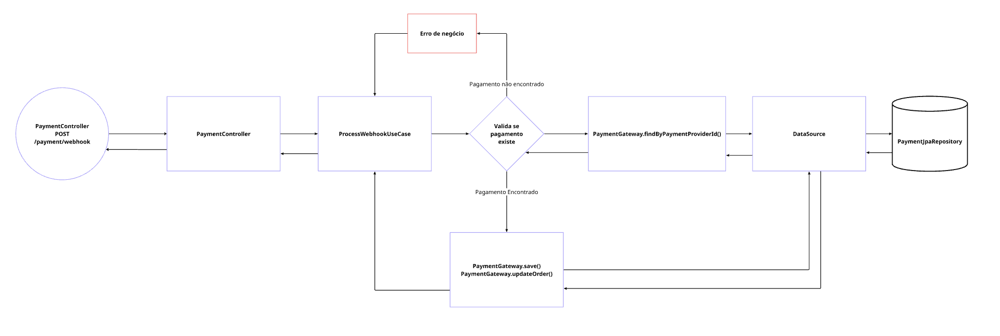
</details>

## Arquitetura de Infraestrutura

A arquitetura implementada segue os seguintes princípios:

- Uma **VPC** com três **subnets públicas**
- Um cluster **EKS** com dois nós
- O backend em **Kotlin** é containerizado e roda no Kubernetes
- O banco de dados **PostgreSQL** também é executado no cluster via StatefulSet
- Uso de **Secrets** e **ConfigMaps**
- Suporte a escalabilidade com **Horizontal Pod Autoscaler (HPA)**, usando o **metrics-server**
- Imagens Docker armazenadas no **ECR**
- Acesso externo ao backend via **LoadBalancer**

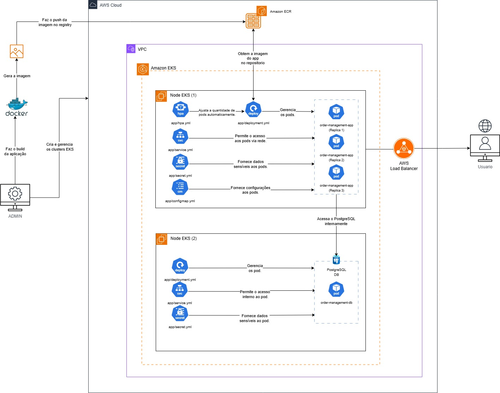

---

## Passo a passo para Deploy


### Pré-requisitos

Certifique-se de ter as ferramentas abaixo instaladas em sua máquina:

| Ferramenta     | Link de instalação oficial |
|----------------|----------------------------|
| **AWS CLI**    | [Instalar AWS CLI](https://docs.aws.amazon.com/cli/latest/userguide/install-cliv2.html) |
| **Terraform**  | [Instalar Terraform](https://developer.hashicorp.com/terraform/downloads) |
| **kubectl**    | [Instalar kubectl](https://kubernetes.io/docs/tasks/tools/install-kubectl/) |
| **Docker**     | [Instalar Docker](https://docs.docker.com/get-docker/) |
| **k9s (opcional)** | [Instalar k9s](https://k9scli.io/topics/install/) |

> 💡 Após instalar tudo, verifique se os comandos `aws`, `terraform`, `kubectl`, `docker` e `k9s` funcionam no terminal.

---

### Atualizar credenciais AWS

Obtenha as credencias no aws details apos iniciar o lab na AWS Academy e altere no arquivo `.aws/credentials`

```text
[default]
aws_access_key_id=
aws_secret_access_key=
aws_session_token=
```

### 1. Inicializar o Terraform

```bash
cd terraform
terraform init -upgrade
terraform plan
terraform apply
```

### 2. Outputs esperados

Exemplo de Output:
```text
Changes to Outputs:
  + aws_s3_bucket_name = "tc-fiap-fast-food-16299ad5"
  + ecr_repository_url = "780442003514.dkr.ecr.us-east-1.amazonaws.com/tc-fiap-fast-food-repo"
  + subnet_cidr        = ["10.0.0.0/20", "10.0.16.0/20", "10.0.32.0/20"]
  + subnet_id          = ["subnet-0d91047b52fb85718", "subnet-0ab84ebfc5aa251a2", ...]
  + vpc_cidr           = "10.0.0.0/16"
  + vpc_id             = "vpc-04de6c3e5bbadc5fb"
```

> 💡 Lembre-se: os outputs serao diferentes, então se atente a mudar onde é necessario `ecr_repository_url`.

## Docker e ECR

### 3. Autenticar no ECR

```bash
aws ecr get-login-password | docker login --username AWS --password-stdin <ecr_repository_url>
```

### 4. Build e push da imagem Docker

```bash
cd ..
# Build da imagem
docker build -t order-management:latest -f docker/Dockerfile .

# Tag da imagem com a URL do ECR
docker tag order-management:latest <ecr_repository_url>:latest

# Push da imagem para o ECR
docker push <ecr_repository_url>:latest
```

---

## ☸️ Configurar o cluster EKS

### 5. Atualizar o kubeconfig

```bash
aws eks update-kubeconfig --name eks-cluster-tc-fiap-fast-food --region us-east-1
```

### 6. Verificar conexão com o cluster

```bash
kubectl get nodes
```

(opcional) usar o [k9s](https://k9scli.io/) para visualização interativa:

```bash
k9s
```

---

## 📊 Instalar metrics-server (para HPA)

```bash
kubectl apply -f https://github.com/kubernetes-sigs/metrics-server/releases/latest/download/components.yaml
```

---

## Aplicar PostgreSQL

```bash
kubectl apply -f k8s/postgres
```

---

## Deploy do App Backend

### 7. Atualizar o campo `image` do Deployment

Antes de aplicar o backend, edite o arquivo `k8s/app/deployment.yaml` e altere o campo `image:` para a URL da imagem no seu ECR:

```yaml
image: <ecr_repository_url>:latest
```

### 8. Aplicar os manifests do backend

```bash
kubectl apply -f k8s/app
```

---

## Acessar o serviço

### 9. Obter o IP externo do serviço

```bash
kubectl get svc
```

Procure pela linha do `order-management` com o tipo `LoadBalancer` e anote o `EXTERNAL-IP`.

### 10. Testar Probes (opcional)

```bash
curl http://<EXTERNAL-IP>:8080/actuator/health/readiness
curl http://<EXTERNAL-IP>:8080/actuator/health/liveness
```

---

## 🧹 Limpar recursos

### 11. Deletar os recursos Kubernetes

```bash
kubectl delete -f k8s/app
kubectl delete -f k8s/postgres
```

### 12. Destruir a infraestrutura AWS

```bash
terraform destroy
```

## Documentação da API

A documentação interativa da API está disponível através do Swagger UI:
- **URL**: http://localhost:8080/swagger-ui.html

### Collection Postman

Para facilitar os testes, disponibilizamos uma collection do Postman com exemplos de requisições:

[](https://github.com/11SOAT-Tech-Challenge-Fast-Food/order-management/blob/main/postman/collections/order-management.postman_collection.json)

## Configuração do Ambiente

### Iniciando com Docker

#### Pré-requisitos

- Docker 20.10+
- Docker Compose 2.0+
- Git
- JDK 17+ (opcional, apenas para desenvolvimento)

1. **Clone o repositório**
   ```bash
   git clone https://github.com/11SOAT-Tech-Challenge-Fast-Food/order-management.git
   cd order-management
   ```

2. **Configure as variáveis de ambiente**
   ```bash
   Edite o arquivo variables-docker.env conforme necessário
   ```

3. **Inicie os containers**
   ```bash
   docker-compose -f docker/docker-compose.yml up -d
   ```

4. **Acesse a aplicação**
   - API: http://localhost:8080
   - Swagger UI: http://localhost:8080/swagger-ui.html
   - Banco de Dados: localhost:5432

5. **Parando a aplicação**
   ```bash
   docker-compose -f docker/docker-compose.yml down
   ```

### Iniciando com Kubernets

TODO

## Desenvolvimento

### Estrutura do Projeto

```
src/
├── main/
│   ├── kotlin/
│   │   └── br/com/fiap/ordermanagement/
│   │       ├── customer/            # Separação por domínio
│   │       │  ├── common/             # Classes comuns ao mundo externo e interno
│   │       │  │  ├── dtos/               # Classes de transferência de dados
│   │       │  │  ├── interfaces/         # Contrato de implementação do mundo externo
│   │       │  │  └── mapper/             # Mapeamento de entidade para DTO e DTO para entidade
│   │       │  ├── core/               # Classes de domínio
│   │       │  │  ├── controllers/        # Entrada do mundo externo
│   │       │  │  ├── entities/           # Entidades do domínio
│   │       │  │  ├── gateways/           # Comunicação com sistemas externos
│   │       │  │  ├── presenters/         # Adaptador de dados para o mundo externo
│   │       │  │  └── usecases/           # Casos de uso da regra de negócio
│   │       │  ├── external/           # Classes de acesso externo
│   │       │  │  ├── api/                # Implementação de rest API
│   │       │  └──└── persistence/        # Implementação do banco de dados
│   │       ├── order/               # Separação por domínio de pedido - Seguindo a estrutura do customer
│   │       ├── payment/             # Separação por domínio de pagamento - Seguindo a estrutura do customer
│   │       ├── product/             # Separação por domínio de produto - Seguindo a estrutura do customer
│   │       └── OrderManagementApplication.kt
│   └── resources/
│       ├── db/migration/        # Scripts do Flyway
│       └── application.yml      # Configurações da aplicação
└── test/                        # Testes automatizados
```

### Padrões de Código

- Siga clean architecture
- Utilize nomes descritivos para variáveis e funções
- Documente funções e classes públicas
- Escreva testes unitários para novas funcionalidades

## Desenvolvedores
| [<br><sub>Bianca Vediner</sub>](https://github.com/BiaVediner) | [<br><sub>Wesley Paternezi</sub>](https://github.com/WesleyPaternezi) | [<br><sub>Guilherme Paternezi</sub>](https://github.com/guilherme-paternezi) |
|:-----------------------------------------------------------------------------------------------------------------------------------------------------------:|:---------------------------------------------------------------------------------------------------------------------------------------------------------------:|:----------------------------------------------------------------------------------------------------------------------------------------------------------------------:|