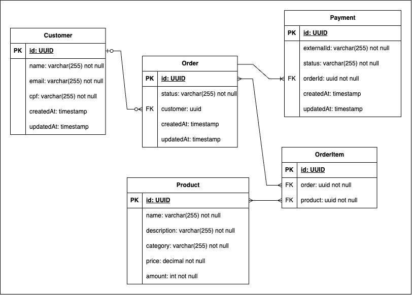

<div align="center">
  <h1>Order Management</h1>
  <p>Sistema de gerenciamento de pedidos para autoatendimento de fast food</p>

[](https://kotlinlang.org/)
[](http://www.gnu.org/licenses/agpl-3.0)
[](https://opensource.org/licenses/)
[](http://www.gnu.org/licenses/agpl-3.0)
[](http://www.gnu.org/licenses/agpl-3.0)
[](http://www.gnu.org/licenses/agpl-3.0)
</div>

## Visão Geral

Projeto desenvolvido para o gerenciamento de autoatendimento de restaurantes, tendo como funcionalidades:

- Gerenciamento de pedidos
- Gerenciamento de clientes
- Gerenciamento de produtos
- Gerenciamento de pagamento

## Índice

- [Visão Geral](#visão-geral)
- [Requisitos de Negócio](#requisitos-de-negócio)
- [Arquitetura de Infraestrutura](#arquitetura-de-infraestrutura)
- [Documentação da API](#documentação-da-api)
- [Documentação da Banco de Dados](#documentação-da-banco-de-dados)
- [Desenvolvimento](#desenvolvimento)
- [Rodando Aplicação Local](#iniciando-com-docker-local)
- [Equipe](#desenvolvedores)

## Requisitos de Negócio

### Gerenciamento de Produtos
<details>
<summary>Clique para expandir</summary>

#### Cadastro de Produtos


#### Atualização de Produtos


#### Consulta de Produtos


#### Produtos por Categoria


#### Consulta por ID


#### Remoção de Produtos

</details>

### Gerenciamento de Clientes
<details>
<summary>Clique para expandir</summary>

#### Cadastro de Cliente


#### Consulta Clientes


#### Consulta cliente por identificador


#### Consulta cliente por cpf


#### Consulta cliente por email


#### Atualização de dados de Clientes


#### Deleta Clientes

</details>

### Gerenciamento de Pedidos
<details>
<summary>Clique para expandir</summary>

#### Cadastro de pedido


#### Atualização de pedido


#### Consulta de pedidos


#### Consulta pedidos por Status


#### Consulta por ID


#### Cancelamento de pedido

</details>

### Gerenciamento de Pagamentos
<details>
<summary>Clique para expandir</summary>

#### Consulta de pagamento por identificador


#### Criação de pagamento para histórico e geração de QRCode no provedor


#### Processamento de webhook do provedor

</details>

## Arquitetura de Infraestrutura

A arquitetura implementada segue os seguintes princípios:

- Uma **VPC** com três **subnets públicas**
- Um cluster **EKS** com dois nós
- O backend em **Kotlin** é containerizado e roda no Kubernetes
- O banco de dados **PostgreSQL** também é executado no cluster via StatefulSet
- Uso de **Secrets** e **ConfigMaps**
- Suporte a escalabilidade com **Horizontal Pod Autoscaler (HPA)**, usando o **metrics-server**
- Imagens Docker armazenadas no **ECR**
- Acesso externo ao backend via **LoadBalancer**


---

## Documentação da API

A documentação interativa da API está disponível através do Swagger UI:
- **URL**: http://localhost:8080/swagger-ui.html

### Collection Postman

Para facilitar os testes, disponibilizamos uma collection do Postman com exemplos de requisições:

[](https://github.com/11SOAT-Tech-Challenge-Fast-Food/order-management/blob/main/postman/collections/order-management.postman_collection.json)

### Documentação Banco de Dados

**Banco de Dados escolhido**: Banco de Dados Relacional - AWS RDS

**Motivo da escolha**: Optamos por escolher um banco de relacional, devido aos fortes relacionamentos
de entidade que desenhamos em nossa regra de negócio... O Banco de dados relacional é o que trás um melhor
gerenciamento para esse fluxo.



## Desenvolvimento

### Estrutura do Projeto

```
src/
├── main/
│   ├── kotlin/
│   │   └── br/com/fiap/ordermanagement/
│   │       ├── customer/            # Separação por domínio
│   │       │  ├── common/             # Classes comuns ao mundo externo e interno
│   │       │  │  ├── dtos/               # Classes de transferência de dados
│   │       │  │  ├── interfaces/         # Contrato de implementação do mundo externo
│   │       │  │  └── mapper/             # Mapeamento de entidade para DTO e DTO para entidade
│   │       │  ├── core/               # Classes de domínio
│   │       │  │  ├── controllers/        # Entrada do mundo externo
│   │       │  │  ├── entities/           # Entidades do domínio
│   │       │  │  ├── gateways/           # Comunicação com sistemas externos
│   │       │  │  ├── presenters/         # Adaptador de dados para o mundo externo
│   │       │  │  └── usecases/           # Casos de uso da regra de negócio
│   │       │  ├── external/           # Classes de acesso externo
│   │       │  │  ├── api/                # Implementação de rest API
│   │       │  └──└── persistence/        # Implementação do banco de dados
│   │       ├── order/               # Separação por domínio de pedido - Seguindo a estrutura do customer
│   │       ├── payment/             # Separação por domínio de pagamento - Seguindo a estrutura do customer
│   │       ├── product/             # Separação por domínio de produto - Seguindo a estrutura do customer
│   │       └── OrderManagementApplication.kt
│   └── resources/
│       ├── db/migration/        # Scripts do Flyway
│       └── application.yml      # Configurações da aplicação
└── test/                        # Testes automatizados
```

### Padrões de Código

- Siga clean architecture
- Utilize nomes descritivos para variáveis e funções
- Documente funções e classes públicas
- Escreva testes unitários para novas funcionalidades


## Rodando aplicação

> **Lembrete**: Nosso repositório já está integrado com o Github Actions para realizar o deploy do kubernets, só abrir o pr para a branch Main e após o merge, será feito o deploy automáticamente

### Iniciando com Docker Local

#### Pré-requisitos

- Docker 20.10+
- Docker Compose 2.0+
- Git
- JDK 17+ (opcional, apenas para desenvolvimento)

1. **Clone o repositório**
   ```bash
   git clone https://github.com/11SOAT-Tech-Challenge-Fast-Food/order-management.git
   cd order-management
   ```

2. **Configure as variáveis de ambiente**
   ```bash
   Edite o arquivo variables-docker.env conforme necessário
   ```

3. **Inicie os containers**
   ```bash
   docker-compose -f docker/docker-compose.yml up -d
   ```

4. **Acesse a aplicação**
    - API: http://localhost:8080
    - Swagger UI: http://localhost:8080/swagger-ui.html
    - Banco de Dados: localhost:5432

5. **Parando a aplicação**
   ```bash
   docker-compose -f docker/docker-compose.yml down
   ```

---

## Desenvolvedores
| [<br><sub>Bianca Vediner</sub>](https://github.com/BiaVediner) | [<br><sub>Wesley Paternezi</sub>](https://github.com/WesleyPaternezi) | [<br><sub>Guilherme Paternezi</sub>](https://github.com/guilherme-paternezi) |
|:-----------------------------------------------------------------------------------------------------------------------------------------------------------:|:---------------------------------------------------------------------------------------------------------------------------------------------------------------:|:----------------------------------------------------------------------------------------------------------------------------------------------------------------------:|